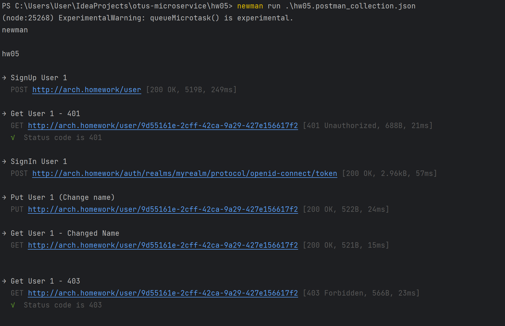

## Описание архитектурного решения
В кластере развернуты:  
API Gateway - Istio  
Auth service - Keycloak  
Profile service - Spring Boot Application  
Для аутентификации пользователь запрашивает access token и передает его с запросами в profile-service.
Profile service валидирует токен и отдает результат.
Также изменение доступно только если id запрашиваемого пользователя совпадает с id аутентифицированного (берется из токена)


## Скрины тестов Postman


## Установка istio с помощью istioctl
```bash
istioctl install --set meshConfig.accessLogFile=/dev/stdout
```
Применить istio.yaml и routes.yaml из каталога gateway
```bash
kubectl apply -f istio.yaml
kubectl apply -f routes.yaml
```
## Установка profile-service
0 - перейти в каталог `profile-service`
```bash
cd profile-service
```
1 - добавить helm репо bitnami
```bash
helm repo add bitnami https://charts.bitnami.com/bitnami
helm repo update
```
2 - установить БД с помощью helm
```bash
helm install postgresql bitnami/postgresql
```
3 - применить манифесты
```bash
kubectl apply -f . 
```

## Установка keycloak
```bash
kubectl create -f https://raw.githubusercontent.com/keycloak/keycloak-quickstarts/latest/kubernetes-examples/keycloak.yaml
```
```bash
minikube service --all
```
Перейти по url сервиса keycloak  
Создать realm через admin console  
Создать пользователя profile-service с паролем profile-service  
Создать нового клиента profile-service для нашего приложения с дефолтными настройками  
Накинуть роль manage-user, user-admin для сервисной учетки profile-service  
Прописать frontend-url http://arch.homework/auth  