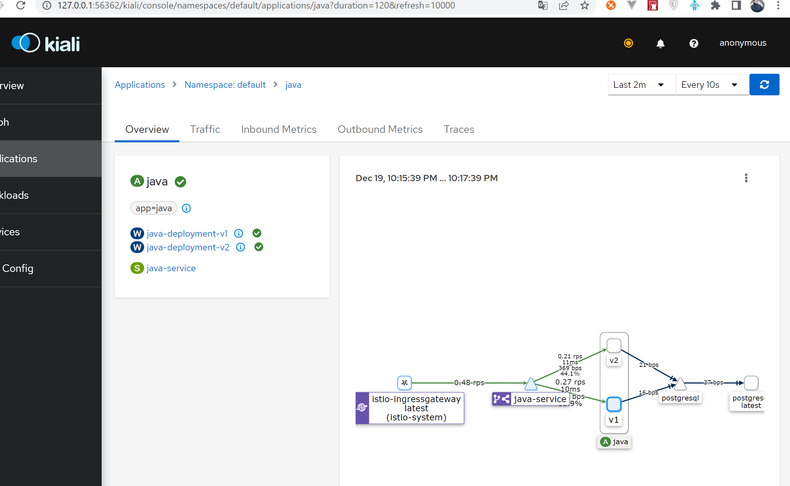

## Описание архитектурного решения
В кластере развернуты:  
API Gateway - Istio  
Profile service - Spring Boot Application - 2 versions  
## Создать namespaces
```bash
kubectl apply -f namespaces.yaml
```

## Установка Jaeger
Перейти в каталог `jaeger`
```bash
helm repo add jaegertracing https://jaegertracing.github.io/helm-charts
helm repo update
```
установить серт менеджер
```bash
kubectl apply -f https://github.com/cert-manager/cert-manager/releases/download/v1.10.1/cert-manager.yaml
```
```bash
helm install -n jaeger-operator -f operator-values.yaml jaeger-operator jaegertracing/jaeger-operator --create-namespace
kubectl apply -f jaeger.yaml
```
## Установка Prometheus
```bash
helm repo add prometheus-community https://prometheus-community.github.io/helm-charts
helm repo add stable https://kubernetes-charts.storage.googleapis.com/
helm repo update
```
```bash
helm install -n monitoring -f operator-values.yaml prometheus prometheus-community/kube-prometheus-stack
```

## Установка istio с помощью istioctl
```bash
istioctl install --set meshConfig.accessLogFile=/dev/stdout
```
Перейти в каталог `gateway`
Применить istio.yaml и routes.yaml из каталога gateway
```bash
kubectl apply -f istio.yaml
kubectl apply -f routes.yaml
```
## Установка Kiali
Перейти в каталог `kiali`
```bash
helm repo add kiali https://kiali.org/helm-charts
helm repo update
```
```bash
helm install -n kiali-operator -f operator-values.yaml kiali-operator kiali/kiali-operator
```
```bash
kubectl apply -f kiali.yaml
```


## Установка profile-service
0 - перейти в каталог `profile-service`
```bash
cd profile-service
```
1 - добавить helm репо bitnami
```bash
helm repo add bitnami https://charts.bitnami.com/bitnami
helm repo update
```
2 - установить БД с помощью helm
```bash
helm install postgresql bitnami/postgresql
```
3 - применить манифесты
```bash
kubectl apply -f . 
```

## Карта сервисов в Kiali
